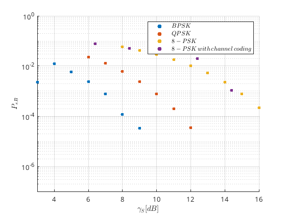
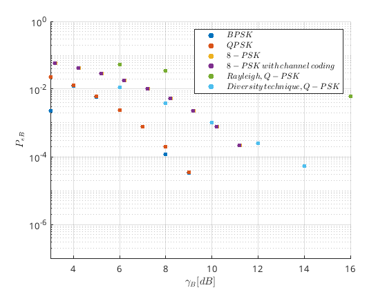

# BER_plot
Matplot plots of experimental results of BER of different constellations with respect to SNR 

### Bit Error Rate Comparison of Different Constellation Maps and the Effect of Channel Coding

### Bit Error Rate Comparison of Different Constellation Maps and the Effect of Channel Coding, Rayleigh Fading, Diversity

